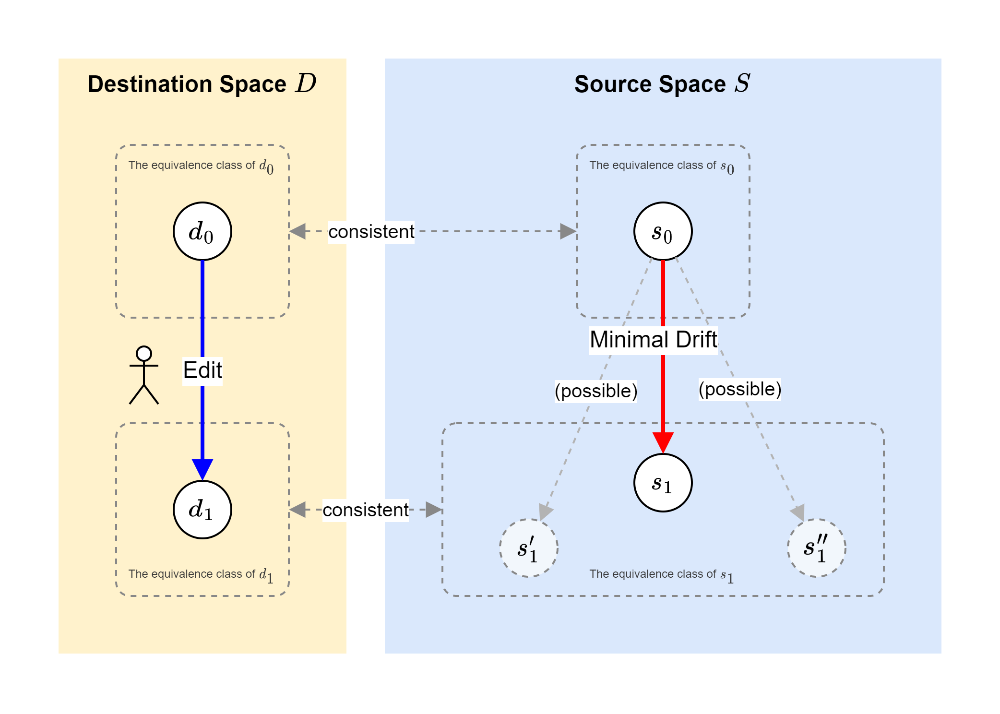
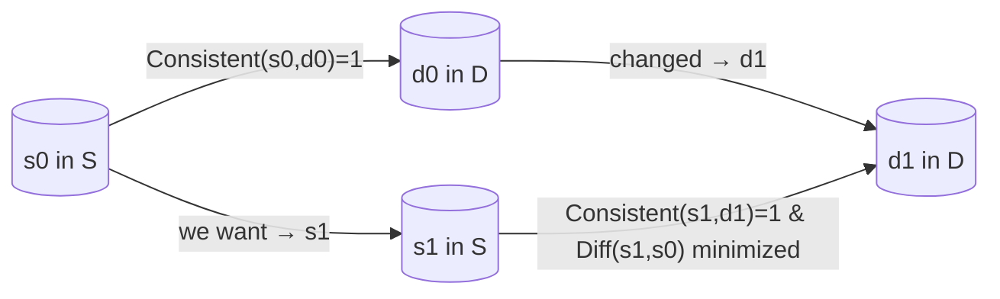

# Minimal Drift Pattern

- [Japanese Version (README_ja.md)](./README_ja.md)
- [Chinese Version (README_zh.md)](./README_zh.md)

## Conclusion (Key Points First)



**Minimal Drift Pattern** is a general-purpose method for reflecting new changes as minimal "diffs" while maintaining the relationship between a source (S) and a destination (D).
It emphasizes an "inertial" approach to editing, where the original intent and structure (e.g., translations, comments, or images) are preserved as much as possible during updates.

Although it can be highly useful with AI-based workflows, such as Large Language Models (LLMs) or Vision-Language Models (VLMs), it also applies to any human-in-the-loop editing process.
In this document, we'll illustrate how it works with the most straightforward example: translating English and Japanese comments in code.

---

## 1. Introduction

In software development and documentation maintenance, **"source information (S) and its corresponding information (D)"** may initially be consistent, but can become out of sync if one side is updated while the other is not.
This problem becomes even more noticeable when automation (e.g., machine translation or LLM-based generation) is involved—each time you update one side, the other may start to drift, leading to repeated inconsistencies.

**Minimal Drift Pattern** explicitly defines consistency between S and D. When you make changes, you aim to keep the "Diff" (difference) to a minimum, thus reducing the risk of the two sides drifting away from each other over multiple updates.

---

## 2. Problem Definition

### 2.1 Source (S) and Destination (D)

- **S**: An element from a certain domain (e.g., original English comments)
- **D**: An element from another domain (e.g., Japanese comments)

When these two have a matching relationship, we denote it using the following function:

$$
Consistent(s, d) =
\begin{cases}
1 & \text{(if s and d are in a valid corresponding relationship)} \\
0 & \text{(if they are not)}
\end{cases}
$$

### 2.2 Consistent and Diff

- **Consistent(s, d)**: A binary function indicating whether a source $s$ and a destination $d$ are in correct correspondence.
- **Diff(s', s'')**: A real-valued function measuring the degree of difference between two source elements $s'$ and $s''$. A larger value means a bigger difference.

These functions are **not limited to LLMs or VLMs**. You could simply use a string distance metric for text, or pixel-level differences for images—whatever makes sense in your project.

---

## 3. Overview of the Minimal Drift Pattern

### 3.1 Motivation

- Even if you align source and destination once, over time one side may change, causing inconsistencies.
- Completely regenerating the destination with machine translation or some automated approach can lead to radical changes, making it harder to maintain or track differences over time.
- **Minimal Drift Pattern** proposes editing workflows that keep updates minimal, ensuring you maintain or quickly restore `Consistent` relationships.

### 3.2 Typical Workflow

1. **Check the Existing Correspondence**
   Assume $Consistent(s_0, d_0) = 1$ for a source $s_0$ and a destination $d_0$.
2. **Destination Is Modified**
   For instance, the user changes $d_0$ to $d_1$.
3. **Update the Source**
   You need to find a source $s$ such that `Consistent(s, d_1) = 1`. Among all possible choices, you pick the $s$ that minimizes `Diff(s, s_0)` to keep drift as small as possible.
4. **Perform the Edit**
   If using an LLM, you can prompt it with "only incorporate the minimal necessary changes."
   If doing this manually, you focus on copying over only the exact changes made on the other side.

---

## 4. Use Cases

While we focus on **translating code comments** as the main example, you can apply this pattern to many other scenarios.
We also encourage you to propose **new use cases via Issues** if you discover additional scenarios where this method can be beneficial.

### 4.1 Translating Code Comments (Use Case 1)

- **S:** English comments in a program
- **D:** Japanese comments in a program
- **Consistent:** Whether the English and Japanese comments properly match
- **Diff:** Amount of change in the English comments (e.g., wording, structure, etc.)

#### 4.1.1 Specific Example

- **Japanese (d_0):**
  > TODO: ユーザー ID の生成方法を UUID などを使用して安全な実装に変更します。

- **English (s_0):**
  > TODO: Change the user ID generation method to a secure implementation using UUID or similar.

Now imagine we modify the Japanese text (d_0) to the following, adding "v4":

- **Japanese (d_1):**
  > TODO: ユーザー ID の生成方法を UUID **v4** などを使用して安全な実装に変更します。

A naive machine translation might significantly alter the sentence structure in English. However, **Minimal Drift** encourages us to keep the original English sentence and only add the "v4" part.

#### 4.1.2 Implementation Example (Translation Prompt)

Below is a sample prompt for an LLM that instructs it to produce a translation with the minimal diff:

> **Prompt (example):**
> ```
> You are given the following texts.
> From here, translate Japanese sentence 1 as appropriate to create English sentence 1.
>
> - Japanese sentence 0
> - English Sentence 0 (This is a translation of Japanese Sentence 0)
> - Japanese Sentence 1 (a partial rewrite of Japanese Sentence 0)
>
> You are to follow the steps below to complete the translation.
>
> Step:
> - First, comprehensively examine the changes made from Japanese Sentence 0 to Japanese Sentence 1.
> - Next, translate all of these changes into the English sentence.
> - Report the resulting translation as English Sentence 1.
>
> Follow these rules:
> - Minimize the changes from Sentence 0 to Sentence 1. Do not make any changes to the sentence structure unless necessary.
> - Make sure that the change to the Japanese sentence and the change to the English sentence are identical without omissions. That is, assert (English sentence 1 - English sentence 0) == (Japanese sentence 1 - Japanese sentence 0).
> ```

This prompt clearly tells the LLM to **apply only the essential differences** in the English translation, preserving the original sentence structure as much as possible while adding the new "v4" part.

---

### 4.2 Automated Code Generation (Use Case 2)

- **S:** Source code
- **D:** Comments (in Japanese or English)
- **Consistent:** Whether the code and comments match
- **Diff:** How much the code itself has changed

If a generation tool drastically rewrites code, you might lose the alignment with existing comments. Applying this pattern helps minimize the discrepancy between code and documentation.

### 4.3 Automated Image Generation (Use Case 3)

- **S:** A generated image
- **D:** The prompt used to generate that image
- **Consistent:** Whether the image and the prompt match
- **Diff:** The difference in images (at the pixel or conceptual level)

By iteratively modifying prompts in a minimal way, you can retain much of the previous image's style or content while making small adjustments.

### 4.4 Other Applications

Minimal Drift Pattern applies to **any scenario where you maintain two corresponding items (S and D) and only want partial edits**.
Feel free to open an **Issue** if you come up with additional ideas!

---

## 5. Visual Overview

Here’s a simple Mermaid diagram illustrating how sources, destinations, and Consistent interact:



1. Initially, $s_0$ and $d_0$ are consistent (`Consistent = 1`).
2. Once $d_0$ changes to $d_1$, we look for $s_1$ such that `Consistent(s1, d1) = 1`.
3. We edit $s_0$ into $s_1$ so that $\mathrm{Diff}(s_1, s_0)$ stays as small as possible.

---

## 6. Implementation Tips

1. **Defining the Diff Function**
   - For text, consider using edit distance or a semantic similarity metric.
   - For images, you might use pixel-wise differences or higher-level features.

2. **Criteria for Consistency**
   - For translations, you might rely on a machine translation check plus human review.
   - For code vs. comments, you could rely on tests or other validation steps.
   - The specifics are up to your project's needs.

3. **Editing Workflow**
   - With an LLM, explicitly instruct it: "Only incorporate changes you detect; preserve the previous structure."
   - With manual editing, apply the same principle: incorporate only the exact diffs from the other side.

---

## 7. About

- **Pattern Name:** Minimal Drift Pattern
- **Repository:** [minimal-drift-pattern](https://github.com/inoueakimitsu/minimal-drift-pattern)
- **Author:** Akimitsu Inoue
