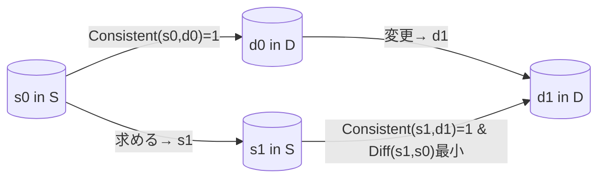

# Minimal Drift Pattern (最小ドリフトパターン)

- [English Version (README.md)](./README.md)  
- [Chinese Version (README_zh.md)](./README_zh.md)

## 結論（先に要点だけ）

**Minimal Drift Pattern**（最小ドリフトパターン）は、あるソース（S）とデスティネーション（D）の対応関係を保ちつつ、新しい変更を最小限の「差分」として反映させるための汎用的な方法論です。  
“慣性”をもたせるように編集し、元々の内容（翻訳やコメント、画像など）の意図や構造を崩さずにアップデートする点がポイントになります。

大規模言語モデル（LLM）や画像生成モデル（VLM）など、AI を活用するシーンだけでなく、Human In the loop（人間が間に入るプロセス）を含むあらゆる編集ワークフローで応用できます。  
ここでは、プログラムの英語コメントと日本語コメントの翻訳例が一番わかりやすいので、まずそれを中心に解説します。

---

## 1. はじめに

ソフトウェア開発現場やドキュメント整備で、**「元の情報（S）と翻訳や対応情報（D）」** が一度は一致していても、片方が更新されるたびにもう一方との整合がズレてしまうケースがよくあります。  
とくに、自動化（機械翻訳や LLM など）を絡めた場合、更新を繰り返すたびに結果が振動してしまい、「いったん整合を取ったはずが、また別のタイミングでズレが生じる…」といった事態が起きがちです。

**Minimal Drift Pattern** では、ソースとデスティネーションの「整合性」を明示的に定義し、実際に変更を加える際は、「Diff（差分）」を必要最小限にとどめるようにすることで、このズレを最小化します。  

---

## 2. 問題設定

### 2.1 ソース (S) とデスティネーション (D)

- **S**: あるドメインに属する要素（たとえば、元の英語コメント）
- **D**: もう一方のドメインに属する要素（たとえば、日本語コメント）

この 2 つが「対応関係」を持つときは、以下の関数を用いて表します。

\[
Consistent(s, d) =
\begin{cases}
1 & \text{(s と d が対応関係にある場合)} \\
0 & \text{(そうでない場合)}
\end{cases}
\]

### 2.2 Consistent と Diff

- **Consistent(s, d)**: ソース \( s \) とデスティネーション \( d \) が正しい対応関係にあるかどうかを返す 2 値関数。
- **Diff(s', s'')**: ソース側の要素 \( s' \) と \( s'' \) の「差異」を定量化する実数値関数。差が大きいほど数値が大きい。

これらは、**LLM や VLM に限定されるものではありません**。単純に「文字列がどれだけ変わったか」を距離関数で定義しても良いし、画像生成であればピクセル単位の差を数値化しても構いません。

---

## 3. Minimal Drift Pattern の概要

### 3.1 動機

- ソースとデスティネーションを一度対応づけておいても、時間が経つとどちらか一方が編集されて不整合が生じる。
- かといって、自動翻訳や自動生成で全面的に作り直すと、今度は編集が大幅に変わって別の問題が出たり、人間がメンテナンスしづらくなったりする。
- **最小ドリフトパターン**では、変更内容を最小限に抑えつつ、常に Consistent を維持・回復させるように編集フローを整える。

### 3.2 具体的なフロー

1. **元の対応をチェック**  
   ソース \( s_0 \) とデスティネーション \( d_0 \) はすでに `Consistent(s_0, d_0) = 1` と仮定します。
2. **デスティネーション側の変更が生じる**  
   例: ユーザーが \( d_0 \) を \( d_1 \) に書き換える。
3. **ソース側をどう更新するか**  
   変更後も `Consistent(s, d_1) = 1` であるようなソース \( s \) を探す。  
   そのとき、`Diff(s, s_0)` を最小化する（= ソース側もなるべくドリフトを小さくする）。
4. **編集作業の実行**  
   もし LLM を使うなら「差分のみを反映せよ」というプロンプトを与えるなどして編集を行う。  
   人間が手動でやる場合でも「変更点だけ移植する」という方針で進める。

---

## 4. 事例集

本パターンは、AI 翻訳だけでなく幅広いケースに応用可能ですが、まずは**コードのコメント翻訳**を軸に事例を紹介します。  
さらに、可能性のある事例を複数挙げておくので、**新しい事例を思いついた方は Issue で提案して**もらうのも歓迎です。

### 4.1 コードコメントの翻訳（事例 1）

- **S:** プログラム内の英語コメント  
- **D:** プログラム内の日本語コメント  
- **Consistent:** 英語と日本語が正しい対訳関係にあるか  
- **Diff:** 英語コメント同士の差分量（単語・文構造の変更度合いなど）

#### 4.1.1 具体例

- **日本語 (d_0):**  
  > TODO: ユーザー ID の生成方法を UUID などを使用して安全な実装に変更します。

- **英語 (s_0):**  
  > TODO: Change the user ID generation method to a secure implementation using UUID or similar.

ここで日本語側を以下のように修正したとします（`v4` の表記を追加）:

- **日本語 (d_1):**  
  > TODO: ユーザー ID の生成方法を UUID **v4** などを使用して安全な実装に変更します。

これを機械翻訳にかけると、文構造が意外と大きく変わってしまうかもしれません。しかし、**Minimal Drift**の考え方では、元の英語文に近い形で `v4` の情報だけを追加すればよいのです。

#### 4.1.2 実装例（翻訳時のプロンプト）

以下のようなプロンプトを LLM に渡すと、必要最小限の差分だけ反映させた翻訳を得られます。

> **指示プロンプト（サンプル）:**
> ```
> あなたに以下を与えます。ここから、適切な翻訳を行い、英語文 1 を作ってください。
>
> - 日本語文 0
> - 英語文 0 (日本語文 0 の翻訳文です)
> - 日本語文 1 (日本語文 0 の一部を書き換えたものです)
>
> あなたは、以下の手順に従い翻訳を行ってください。
>
> 手順:
> - まず、日本語文 0 から 日本語文 1 への変更内容を網羅的に調べてください。
> - 次に、英語文に、これらの変更内容を翻訳し全て反映してください。
> - 得られた翻訳文を英語文 1 として報告してください。
>
> 以下のルールに従ってください:
> - 英語文 0 から 英語文 1 への変更が、最低限にしてください。文章の構造の変更などは必要なければ行わないでください。
> - 日本語文への変更と、英語文への変更が抜け漏れなく同一であることを確認してください。つまり assert (英語文 1 - 英語文 0) == (日本語文 1 - 日本語文 0) です。
> ```

このプロンプトにより、**「Diff が最小限になるよう翻訳せよ」**という意図を LLM に正しく伝えられます。結果として、もとの英語文と構造が大きく変わらず、`v4` だけが追加された翻訳を得やすくなります。

---

### 4.2 自動コード生成（事例 2）

- **S:** コード  
- **D:** コードに対するコメント（日本語または英語）  
- **Consistent:** コード内容とコメント内容が対応しているか  
- **Diff:** コード本体の変更量

生成系のツールを使うとコードが大幅に書き換わるときもありますが、最小限の修正だけで用が足りる場合は、このパターンを適用することでコメントとの食い違いを最小化できます。

### 4.3 自動画像生成（事例 3）

- **S:** 生成された画像  
- **D:** 画像生成プロンプト  
- **Consistent:** 画像とプロンプトが正しい対応関係にあるか  
- **Diff:** 画像の変化量（画素単位の差分や構図の違いなど）

画像合成を繰り返す際、元画像と大きく異なる画像になるときは、Minimal Drift Pattern の考え方でプロンプトを調整することで「前回のイメージを踏襲したまま部分的に修正」できる可能性があります。

### 4.4 その他の応用

LLM や VLM に限らず、**「2 つの対応関係を常に維持したまま部分的に修正する」**シチュエーションであれば何にでも応用できます。  
もし新しい応用シーンを思いついたら、ぜひ **Issue** で提案してください！

---

## 5. 仕組みを図でイメージする

以下の Mermaid 図は、ソース・デスティネーション・Consistent 関数の関係をざっくり示したイメージです。



1. 元々 \(s_0\) と \(d_0\) は整合している (`Consistent = 1`)。  
2. \(d_0\) が \(d_1\) に変化したら、\(s_1\) を新たに決める。`Consistent(s1, d1) = 1` であることが必須。
3. このとき、\(\mathrm{Diff}(s_1, s_0)\) を最小にするように編集して、ドリフトをできる限り小さく抑える。

---

## 6. 実装のポイント

1. **Diff 関数の設計**  
   - 文字列であれば「編集距離」的なアプローチでも良いし、意味論的な距離を測る方法でも良い。  
   - 画像ならピクセルの差分や画像特徴量ベースの指標を使うかもしれない。

2. **Consistent 判定の基準**  
   - 翻訳かどうか → 機械翻訳と人間の評価を組み合わせるか？  
   - コードとコメントの対応 → テストを走らせてエラーが起きないかどうか？  
   - ここも自由度が高いので、プロジェクトに応じて適宜カスタマイズする。

3. **編集フローにおける運用**  
   - LLM を使う場合は、「差分のみを反映せよ」「前の構造をなるべく保て」という明示的なプロンプトが有効。  
   - 人間が手動で編集する場合も、同じ発想で「変更点だけ反映する」という手順を意識する。

---

## 7. About

- **Pattern Name:** Minimal Drift Pattern (日本語では「最小ドリフトパターン」)  
- **Repository:** [minimal-edit-pattern](https://github.com/your-account/minimal-edit-pattern)  
- **Author:** Akimitsu Inoue
