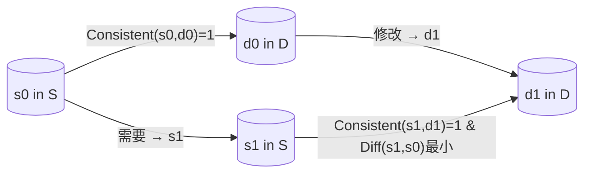

# Minimal Drift Pattern (最小Drift模式)

- [Japanese Version (README_ja.md)](./README_ja.md)  
- [English Version (README.md)](./README.md)

## 结论（先说重点）

**Minimal Drift Pattern**（最小Drift模式）是一种通用方法，能够在维持源（S）与目标（D）之间对应关系的同时，将新的变更以最小“差分”的方式反映出来。  
它强调一种带有“惯性”的编辑方式，在更新过程中尽量保持原有内容（翻译、注释、图像等）的意图与结构。

虽然该模式可广泛应用于大规模语言模型（LLM）或视觉语言模型（VLM）驱动的工作流，但它并不限于此；任何包含人工介入（Human in the loop）的编辑流程都可以采用。  
在这里，我们先以对程序中的英日注释进行翻译为例进行说明。

---

## 1. 引言

在软件开发与文档维护中，**“源信息（S）与对应信息（D）”** 可能起初已经一致，但只要一方更新，另一方就容易出现不一致。  
如果涉及自动化（机器翻译或 LLM 等），每次更新都可能导致结果波动，出现“本来已经对齐了，后来又在其他地方出现偏差”的情况。

**Minimal Drift Pattern** 通过对 S 与 D 的“一致性”做出明确定义，并在实际操作时，努力将“差分”限制在最小范围内，从而避免二者反复出现偏离。

---

## 2. 问题设定

### 2.1 源 (S) 与目标 (D)

- **S**：来自某个领域的元素（例如，原始英文注释）
- **D**：来自另一个领域的元素（例如，日文注释）

当二者具有对应关系时，用以下函数表示：

\[
Consistent(s, d) =
\begin{cases}
1 & \text{（s 与 d 处于正确对应关系）} \\
0 & \text{（不对应）}
\end{cases}
\]

### 2.2 Consistent 与 Diff

- **Consistent(s, d)**：一个二值函数，判断源 \( s \) 与目标 \( d \) 是否处于正确的对应关系。  
- **Diff(s', s'')**：一个实数值函数，用于衡量 \( s' \) 与 \( s'' \) 在源域中的差异程度。差异越大，数值越高。

请注意，这些函数**并不限于 LLM 或 VLM**。对于文本，可以简单用字符串编辑距离；对于图像，可以使用像素级差分或更高级的图像特征。

---

## 3. Minimal Drift Pattern 概述

### 3.1 动机

- 即使起初已对齐源与目标，时间一长，随任何一方被修改，就可能导致不一致。  
- 如果全部重新生成翻译或文档，可能造成大范围变动，影响可维护性。  
- **最小Drift模式**旨在让每次的变更都保持在尽可能小的范围，从而持续维持或快速修复 `Consistent` 状态。

### 3.2 具体流程

1. **检查原本的对应关系**  
   设定 \( Consistent(s_0, d_0) = 1 \)，其中 \( s_0 \) 与 \( d_0 \) 一开始已经对齐。  
2. **目标端被修改**  
   例如，用户将 \( d_0 \) 改成 \( d_1 \)。  
3. **决定如何更新源端**  
   需找到一个 \( s \) ，使得 `Consistent(s, d_1) = 1`。同时要令 `Diff(s, s_0)` 尽量小，以保证源端改动也最小。  
4. **执行编辑**  
   若借助 LLM，可给出“仅应用差分变更”的提示。  
   如果纯手动编辑，也要遵循“只移植必要的改动”这一方针。

---

## 4. 实例集

该模式不仅适用于**翻译**场景，还能延伸到多种情况。  
以下以**代码注释翻译**作为主要示例，同时也列举更多可能场景。  
若有其它新点子，也欢迎通过 **Issue** 进行提案。

### 4.1 代码注释翻译（实例1）

- **S**：程序中的英文注释  
- **D**：程序中的日文注释  
- **Consistent**：两者是否正确对应（英日对译关系）  
- **Diff**：英文注释间的差异程度（单词、句子结构等）

#### 4.1.1 具体示例

- **日文 (d_0)：**  
  > TODO: ユーザー ID の生成方法を UUID などを使用して安全な実装に変更します。

- **英文 (s_0)：**  
  > TODO: Change the user ID generation method to a secure implementation using UUID or similar.

现假设我们将日文侧从 d_0 改为 d_1（添加 “v4”）：

- **日文 (d_1)：**  
  > TODO: ユーザー ID の生成方法を UUID **v4** などを使用して安全な実装に変更します。

若直接使用机器翻译，英文句子结构可能变化很大。但在 **Minimal Drift** 的思路下，只需在英文原句上添加 “v4”，而保留其他部分不变。

#### 4.1.2 实现示例（翻译提示）

向 LLM 提供如下提示，可得到最小差分的翻译版本：

> **指令提示（示例）：**
> ```
> 给你以下内容。 在此基础上，翻译出英语句子 1。
>
> - 日语句子 0
> - 英语句子 0（日语句子 0 的译文）
> - 日语句子 1（日语句子 0 的部分改写）。
>
> 您按照以下步骤进行翻译。
>
> 步骤：
> - 首先，全面检查从日语句子 0 到日语句子 1 的改动。
> - 接下来，翻译并在英语文本中反映所有这些变化。
> - 将翻译结果报告为英语句子 1。
>
> 遵循以下规则：
> - 从英语句子 0 翻译到英语句子 1。
> - 尽量减少从英语句子 0 到英语句子 1 的改动。 如无必要，不要对句子结构做任何改动。
> - 确保对日语句子的改动与对英语句子的改动完全相同，没有遗漏。 也就是说，断言（英语句子 1 - 英语句子 0）==（日语句子 1 - 日语句子 0）。
> ```

通过这种提示，LLM 会**尽量维持原有句子的结构**，并只在必要之处新增 “v4” 字样，实现最小差分翻译。

---

### 4.2 自动化代码生成（实例2）

- **S**：代码  
- **D**：针对代码的注释（英文或日文）  
- **Consistent**：代码与注释是否对应  
- **Diff**：代码本体的改动量

自动生成工具有时会大幅重写代码，从而使注释不再匹配；利用此模式可将差异压缩到最低限度，保持代码与注释的一致。

### 4.3 自动化图像生成（实例3）

- **S**：生成的图像  
- **D**：生成图像时的提示（Prompt）  
- **Consistent**：图像与提示间是否对应  
- **Diff**：图像之间（像素或构图）的差异程度

通过最小改动调节提示，可以在较大程度保留上一版图像的风格或内容，仅针对局部做修改。

### 4.4 其它应用

无论是否使用 LLM 或 VLM，**“维持源(D)与目标(D)的对应关系并仅进行局部改动”** 的需求在许多场景都存在。  
如果你想到更多用途，请随时通过 **Issue** 提出！

---

## 5. 原理示意图

下面的 Mermaid 图简单展示了源、目标及 Consistent 函数之间的关系：



1. 初始时 \( s_0 \) 与 \( d_0 \) 保持一致（`Consistent = 1`）。  
2. \( d_0 \) 被修改成 \( d_1 \) 后，需要找出 \( s_1 \) 使得 `Consistent(s1, d1) = 1`。  
3. 编辑 \( s_0 \) 到 \( s_1 \) 的同时，需要让 \(\mathrm{Diff}(s_1, s_0)\) 尽量小，减少“漂移”。

---

## 6. 实施要点

1. **Diff 函数的设计**  
   - 对文本可使用编辑距离或语义相似度。  
   - 对图像可使用像素级或特征级的度量。

2. **Consistent 判定标准**  
   - 翻译：可结合机器翻译与人工评审。  
   - 代码与注释：可通过测试或分析工具来验证一致性。  
   - 具体由项目需求决定。

3. **编辑流程的运作**  
   - 若借助 LLM，需明确提示“仅整合必要的修改，尽量保留原结构”。  
   - 手工处理时，也应遵循“只整合真正需要的改动”。

---

## 7. About

- **Pattern Name:** Minimal Drift Pattern (最小Drift模式)  
- **Repository:** [minimal-edit-pattern](https://github.com/inoueakimitsu/minimal-drift-pattern)  
- **Author:** Akimitsu Inoue
